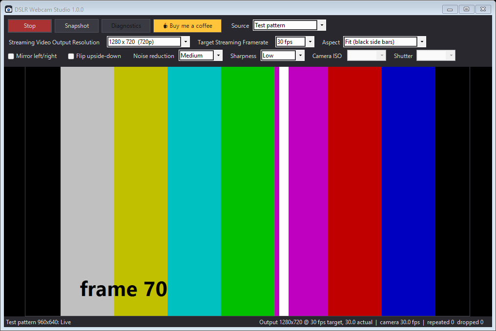

<p align="center"></p>

<h1 align="center">DSLR Webcam Studio</h1>

<p align="center">
  Use your Canon EOS camera as a webcam: free, open source, no Canon software needed.<br>
  Windows 10/11 · macOS and Linux coming later
</p>

<p align="center">
  <a href="https://github.com/akshay4/dslr-webcam-studio/releases/latest"></a>
  <a href="https://paypal.me/shekhawatakshay"></a>
</p>

<p align="center"></p>

## Features

- **Works as a webcam** in OBS, Streamlabs, Zoom, Teams, Discord, browsers and more: it adds a camera called
  **"DSLR Webcam Studio"** (Windows 11; see [Use it as a webcam](#use-it-as-a-webcam)).
- **Live preview** from a Canon EOS camera over USB. The app talks to the camera directly; no Canon
  drivers, DLLs or subscriptions.
- **Streaming Video Output Resolution**: 640×360, 1280×720 or 1920×1080.
- **Target Streaming Framerate**: 15, 24, 25 or 30 fps, held exactly (see [How it works](#how-it-works)).
- **Fit or Fill**: show the camera's 3:2 picture with side bars, or crop it to 16:9.
- **Mirror** left/right and **flip** upside-down.
- **Noise reduction** and **sharpness**: four levels each, cleans up grainy low-light video.
- **Camera ISO and shutter** control, plus a live readout of mode, ISO, shutter and aperture.
- **Snapshot** to PNG, **Diagnostics** report, automatic reconnect.

## Download

**Windows 10/11 (64-bit):** download `DSLR_Webcam_Studio-<version>-Windows-x64.exe` from the
[latest release](https://github.com/akshay4/dslr-webcam-studio/releases/latest) and run it. It's one ~280 KB file
with nothing to install; put it anywhere you like. If SmartScreen appears (the app isn't code-signed), click
**More info → Run anyway**. Each release also has `SHA256SUMS.txt` for verifying the download.

**macOS and Linux:** work in progress, coming in a later release. The source is in [`macos/`](macos) and
[`linux/`](linux) and builds in CI, but it hasn't been tested with a camera yet.

## Quick start

1. Connect the camera with its USB cable and switch it on.
2. Set the mode dial to **M** (or P/Tv/Av, or movie mode) and make sure **Live View** is enabled in the camera menu.
3. Start DSLR Webcam Studio. Live view starts automatically.
4. Pick the resolution, framerate and image options. Settings are saved for next time.

## Use it as a webcam

**Windows 11:** click **Install virtual camera** in the app once and approve the Windows prompt. From then on, while
DSLR Webcam Studio is running, pick **"DSLR Webcam Studio"** as the camera in OBS (*Video Capture Device*),
Streamlabs, Zoom, Teams, Discord, Chrome/Edge or the Windows Camera app. The camera follows the app's output
resolution, framerate, flips and image settings. Remove it with `DSLRWebcamStudio.exe --uninstall-vcam`.
(Windows 10 lacks the virtual-camera API, so the app shows preview only there.)

**macOS / Linux (in progress):** Linux will use v4l2loopback (the code is in `linux/src/vcam.c`). On macOS a virtual
camera needs a Camera Extension signed with a paid Apple Developer ID.

**For a clean picture:** in a dim room the camera's Auto ISO climbs high and the image gets grainy. Set the dial to
**M**, choose **ISO 400–800** and **shutter 1/30–1/60** in the app, open the aperture as wide as your lens allows,
and keep **Noise reduction** on Medium. More light on your face helps most of all.

**If it doesn't connect:** close Canon EOS Utility / EOS Webcam Utility (they hold the camera), then press **Diagnostics** and include the report
when you [open an issue](https://github.com/akshay4/dslr-webcam-studio/issues).

## Supported cameras

Canon EOS DSLR and mirrorless bodies that support live view over USB (roughly 2009 onward) use the same protocol
and should work. Tested so far:

| Camera | Result on Windows |
|---|---|
| EOS 700D / Rebel T5i / Kiss X7i | ✅ 960×640 live view, ~17 fps, ISO/shutter control, virtual webcam |

Tested your camera? Please open an issue with your Diagnostics report and this table will be updated.

## How it works

```
Camera ──USB/PTP──▶ Live-view JPEG ──▶ Noise reduction ──▶ Sharpen ──▶ Bicubic scale + flip ──▶ Fixed-rate output ──▶ Preview
           (thread 1: as fast as the camera delivers)          (thread 2: once per output tick, on a fixed timeline)
```

**Talking to the camera.** Canon cameras speak PTP (Picture Transfer Protocol) with Canon-specific extensions. Each
app sends the same sequence: `SetRemoteMode (0x9114)` → `SetEventMode (0x9115)` → set property `EVF output device
(0xD1B0)` to *PC* with `SetDevicePropValueEx (0x9110)` → poll `GetViewFinderData (0x9153)`, which returns a JPEG
frame (or *not ready*). `GetEvent (0x9116)` is polled every 0.5 s; besides keeping the camera responsive, it reports
property changes, which is how the app knows the current mode, ISO, shutter and aperture. These are the same public
opcodes used by [libgphoto2](https://github.com/gphoto/libgphoto2). Each platform uses its native USB path:

| Platform | Language / UI | Camera transport |
|---|---|---|
| Windows | C# (.NET Framework 4.8, built into Windows) + WinForms | Windows Portable Devices API, raw PTP via the MTP-extension commands of the built-in `WUDFWpdMtp` driver |
| macOS (in progress) | Swift + SwiftUI | Apple ImageCaptureCore `requestSendPTPCommand` |
| Linux (in progress) | C + GTK 3 | libusb, PTP bulk transfers (USB still-image class) |

**Holding the framerate.** The camera delivers frames at its own pace (about 17 fps on a 700D in photo live view) and
that pace drifts. Like a real webcam, the output runs on a fixed timeline at exactly the target rate. Each tick sends
the newest processed frame: if the camera is faster, frames are dropped; if slower, the last one is repeated. If a
tick is ever late, the pacer skips to the next slot instead of sending a burst. The status bar shows the real camera
rate and how many frames were repeated or dropped.

**Sending on time.** Each tick first sends the frame prepared during the previous slot, then processes the newest
camera frame for the next one. Processing time therefore never shifts send times (cost: one frame of latency).

**Cleaning up the picture.**
- *Noise reduction* is a motion-adaptive temporal filter. Each pixel blends with its running average, but the blend
  is decided from the brightness change averaged over a 3×3 neighbourhood: random sensor noise cancels out in that
  average while real movement doesn't. Static areas (walls, background) get averaged over several frames; moving
  areas use the new frame directly, so there's no ghosting. On a 700D at high ISO it cuts frame-to-frame noise by
  42 / 54 / 62 % (Low / Medium / High).
- *Sharpness* is a 3×3 unsharp mask with a small dead zone so leftover noise isn't amplified.
- *Scaling* is separable Catmull-Rom bicubic (crisper than bilinear when upscaling the 960×640 live view), with the
  kernel widened when shrinking to avoid aliasing. Mirroring and flipping are done inside the scaler for free.
  All of this runs across CPU cores: about 4–6 ms per frame at 1080p.

**Virtual camera.** On Windows 11 the app registers a camera with Windows' own virtual-camera API
(`MFCreateVirtualCamera`). The camera is a small Media Foundation media source (`windows/vcam/vcam.cpp`, a 180 KB DLL
embedded in the exe) that Windows' Camera Frame Server loads whenever an app opens the camera. The one-time install
copies it to `C:Program FilesDSLR Webcam Studio` (writable by administrators only, since a Windows service loads it);
the shared frame buffer is accessible only to the logged-on user and the camera service. Frame Server then
shares it with every app at once and converts formats as needed (NV12, YUY2, RGB). The app hands each output frame to
the media source through a shared-memory section with a sequence lock. When the app isn't sending, the camera
shows a dark placeholder. On Linux the app writes YUYV frames to a v4l2loopback device.

**Settings** live in `config.ini` (`[Global] StreamWidth / StreamHeight / StreamFps / FitMode / FlipHorizontal /
FlipVertical / NoiseReduction / Sharpness`), in `%APPDATA%\DSLR Webcam Studio\` on Windows,
`~/Library/Application Support/DSLR Webcam Studio/` on macOS and `~/.config/dslr-webcam-studio/` on Linux.

## Building from source

| Platform | Command | Needs |
|---|---|---|
| Windows | `powershell -ExecutionPolicy Bypass -File windows\build.ps1` | Nothing to install: uses the C# compiler that ships with Windows, and downloads the portable Zig C++ toolchain for the virtual camera on first build |
| macOS | `bash macos/build.sh` | Xcode command line tools |
| Linux | `cd linux && make` (or `bash package-appimage.sh`) | `build-essential pkg-config libgtk-3-dev libusb-1.0-0-dev` |

Every app has a built-in test mode (`--selftest`) that checks settings, geometry, pacing, scaling, flips, noise
reduction and protocol parsing; CI runs it on all three platforms. Windows also supports
`DSLRWebcamStudio.exe --selftest <dir> camera` to test the whole pipeline against a connected camera.

```
VERSION          version shared by all apps (also used for release tags)
DONATE_URL       PayPal link shown by the in-app coffee button
windows/         C# app        macos/   Swift app        linux/   C + GTK app
assets/          icon (SVG + PNG + ICO)    tools/MakeIcons.cs renders them
.github/         CI: builds + self-tests every push; a vX.Y.Z tag publishes a release
```

## Releasing a new version

Versions follow [Semantic Versioning](https://semver.org/) (`MAJOR.MINOR.PATCH`); the single source of truth is
[`VERSION`](VERSION), which the app's title bar, file version and release name all come from.

1. Update `VERSION` and add a `## [x.y.z] - date` section to [`CHANGELOG.md`](CHANGELOG.md).
2. Commit, then tag and push: `git tag v1.0.1 && git push origin main v1.0.1`.
3. GitHub Actions checks that the tag matches `VERSION`, builds the app, runs the self-tests (app + virtual camera)
   and publishes a GitHub Release with the exe, `SHA256SUMS.txt` and the changelog section as notes.

## Support the project

DSLR Webcam Studio is free. If it saved you buying a webcam or a subscription, you can
[**buy me a coffee ☕**](https://paypal.me/shekhawatakshay). Thank you!

## License and trademarks

[MIT](LICENSE) © Akshay Singh Shekhawat.

This is an independent project, not affiliated with or endorsed by Canon Inc. Canon and EOS are trademarks of
Canon Inc., used here only to describe compatibility.
